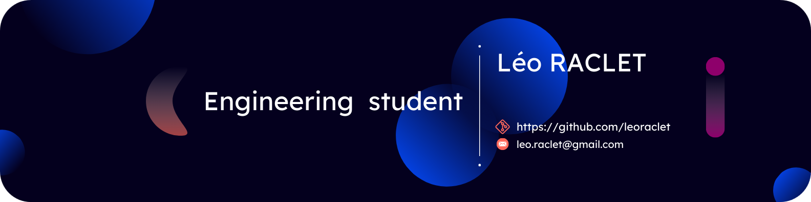  

## 🤔 &nbsp; About Me !

Hi 👋 ! My name is Leo, and I'm a french engineering student in second year at [**Télécom
Saint-Etienne**](https://www.telecom-st-etienne.fr/), in France 🇫🇷 . I'm particularly interested
in computer science and cybersecurity 🖥️.

Meanwhile, I also develop things on my free time, mostly in **C / C++** and **Python**, but I always
use and learn new tools.  

### 📭 &nbsp; Contact

Feel free to contact me on my email address. You can also check my **LinkedIn** and **Root-Me**
profiles 👤 !

&nbsp;

&nbsp;

&nbsp;

&nbsp;  

### 🛠️ &nbsp; Languages & Tools

While developping my projects, I have learned and used many languages and tools :

 

 &nbsp;&nbsp;&nbsp;&nbsp;
 &nbsp;&nbsp;&nbsp;&nbsp;
 &nbsp;&nbsp;&nbsp;&nbsp;
 &nbsp;&nbsp;&nbsp;&nbsp;
 &nbsp;&nbsp;&nbsp;&nbsp;
 &nbsp;&nbsp;&nbsp;&nbsp;
 &nbsp;&nbsp;&nbsp;&nbsp;
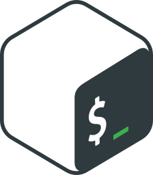 &nbsp;&nbsp;&nbsp;&nbsp;
 &nbsp;&nbsp;&nbsp;&nbsp;
 &nbsp;&nbsp;&nbsp;&nbsp;
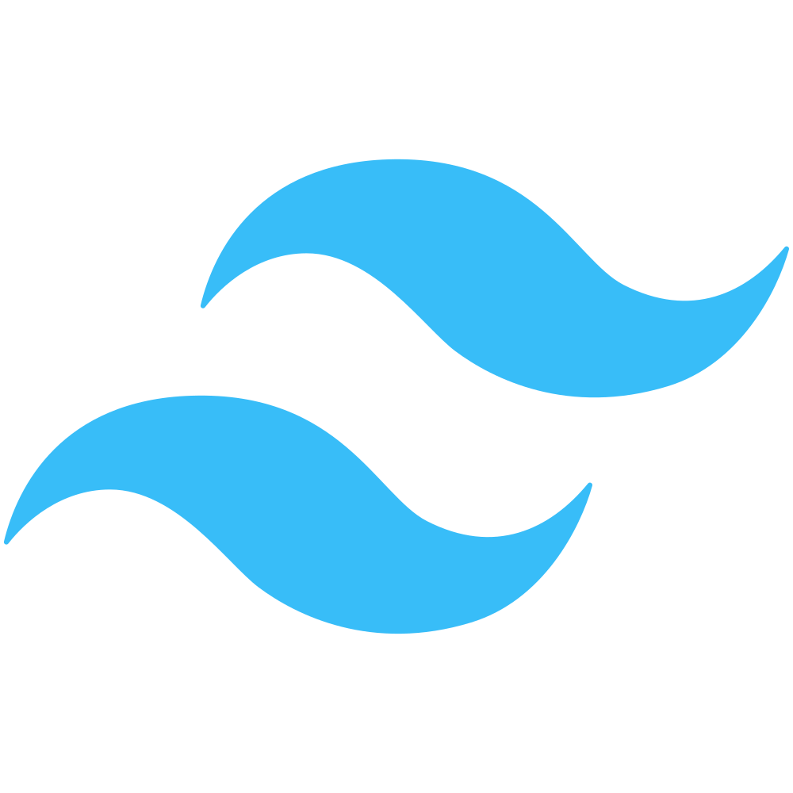

 &nbsp;&nbsp;&nbsp;&nbsp;
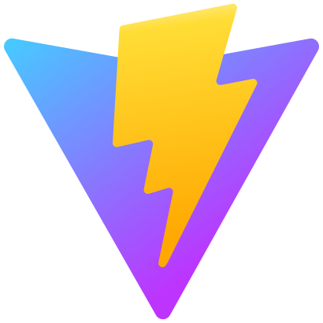 &nbsp;&nbsp;&nbsp;&nbsp;
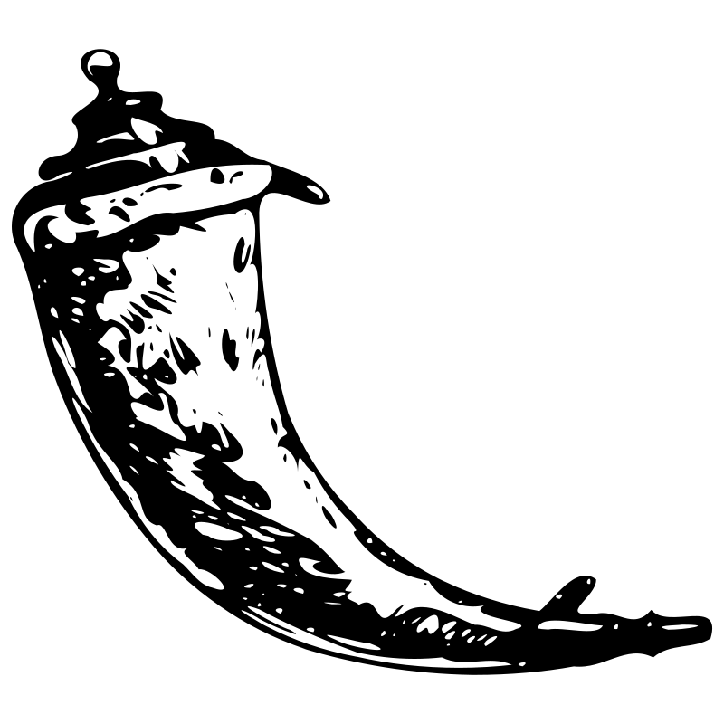 &nbsp;&nbsp;&nbsp;&nbsp;
 &nbsp;&nbsp;&nbsp;&nbsp;
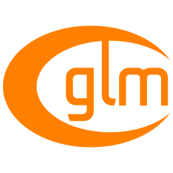 &nbsp;&nbsp;&nbsp;&nbsp;
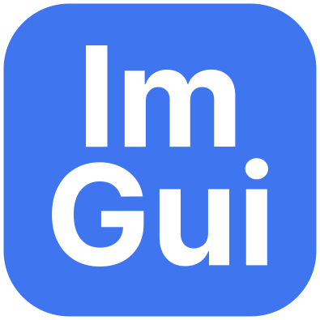 &nbsp;&nbsp;&nbsp;&nbsp;
 &nbsp;&nbsp;&nbsp;&nbsp;
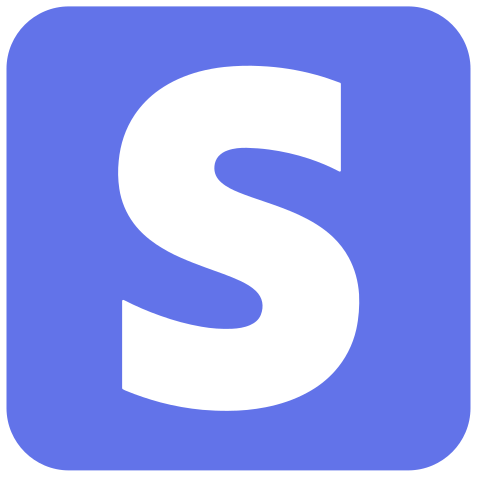 &nbsp;&nbsp;&nbsp;&nbsp;
 &nbsp;&nbsp;&nbsp;&nbsp;
 &nbsp;&nbsp;&nbsp;&nbsp;
 &nbsp;&nbsp;&nbsp;&nbsp;

 &nbsp;&nbsp;&nbsp;&nbsp;
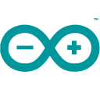 &nbsp;&nbsp;&nbsp;&nbsp;
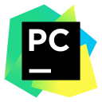 &nbsp;&nbsp;&nbsp;&nbsp;
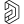 &nbsp;&nbsp;&nbsp;&nbsp;
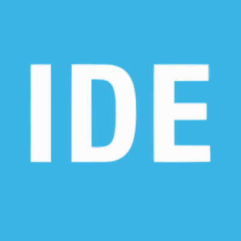 &nbsp;&nbsp;&nbsp;&nbsp;
 &nbsp;&nbsp;&nbsp;&nbsp;
 &nbsp;&nbsp;&nbsp;&nbsp;
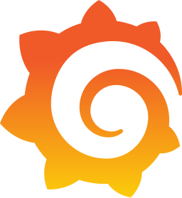 &nbsp;&nbsp;&nbsp;&nbsp;
 &nbsp;&nbsp;&nbsp;&nbsp;
 &nbsp;&nbsp;&nbsp;&nbsp;
 &nbsp;&nbsp;&nbsp;&nbsp;

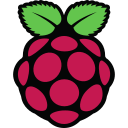 &nbsp;&nbsp;&nbsp;&nbsp;
 &nbsp;&nbsp;&nbsp;&nbsp;
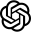 &nbsp;&nbsp;&nbsp;&nbsp;
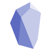

 

## 📂 &nbsp; Projects

## [❄️ &nbsp; Fractal generator *(2022)*](https://github.com/leoraclet/fractals)

This program is a fractal generator, made in **C / C++** using **SFML**, that let you generate and
explore colored fractals such as Mandelbrot and Julia sets. Deep zooms in real time are made by
possible by emulating double floating precision on GPU.  

	<a href="https://github.com/leoraclet/fractals">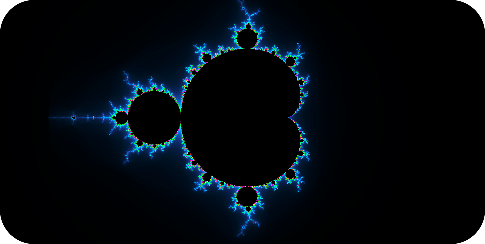</a>

 

## [🛡️ &nbsp; Game of life *(2021)*](https://github.com/leoraclet/game-of-life)

This program is a simulation of the famous Game of Life invented by the Cambridge mathematician John
Conway in 1970. It is made in **C / C++** using the **SDL**.  

	<a href="https://github.com/leoraclet/game-of-life">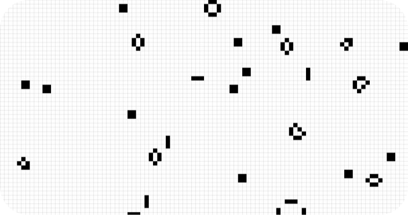</a>

 

## [🪙 &nbsp; Unycoin *(2023)*](https://github.com/leoraclet/unycoin)

This project is a pure **Python** implementation of a cryptocurrency similar to Bitcoin as it was
first introduced by Satoshi Nakamoto's whitepaper : [Bitcoin: A Peer-to-Peer Electronic Cash
System](https://bitcoin.org/bitcoin.pdf).  

	<a href="https://github.com/leoraclet/unycoin">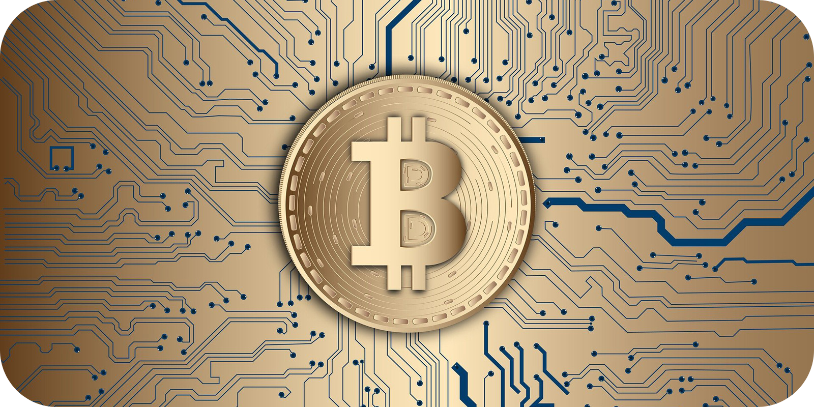</a>

 

## Stats

&nbsp;

