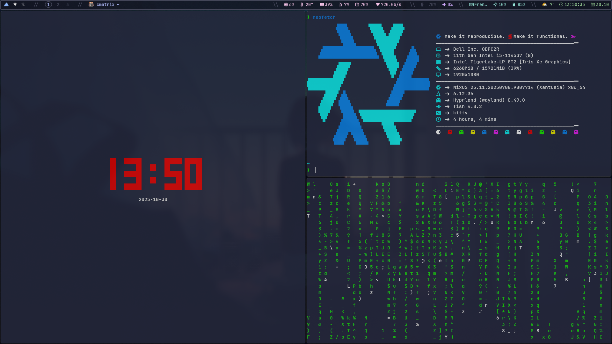
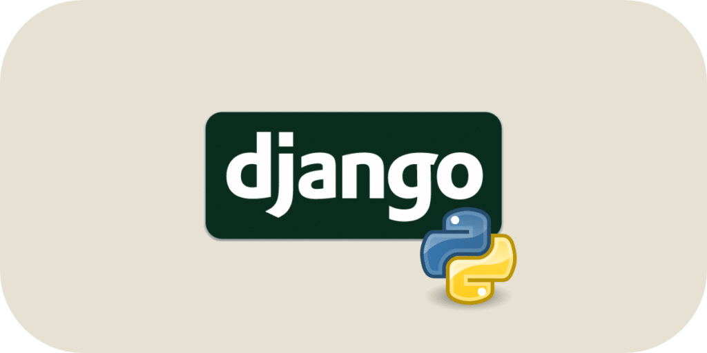
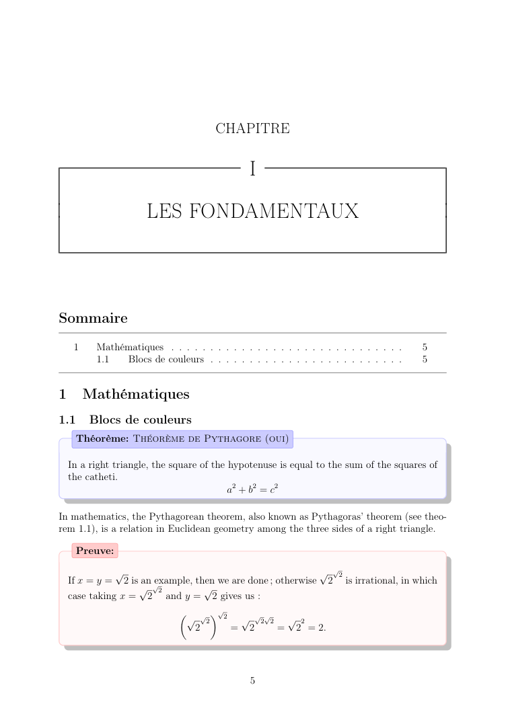
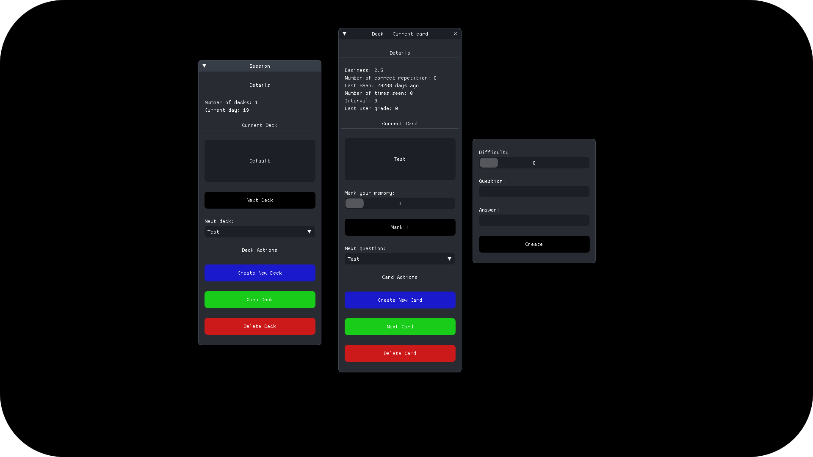

## 🤔 &nbsp; About Me

Hi there 👋! I'm **Leo**, a French 🇫🇷 developer, cybersecurity enthusiast and lifelong learner, always pushing my limits to understand our World. I have a strong interest in **computer science** and **cybersecurity** 🖥️.

In my free time, I enjoy developing projects, primarily using **C/C++** and **Python**, but I'm always eager to explore and learn new tools & technologies. I also consistently train my hacking skills online, through platforms and CTFs :

- 👉 Top **13** Hackfest CTF
- 👉 Top **2** MiniCTF (UQAC homemade CTF)
- 👉 Top **100** 404CTF 2024 & 2025
- 👉 Top **50** HeroCTF v6 & v4
- 👉 Top **1%** on [Root-Me](#-cybersecurity) (Score: 6960 pts)

Currently, I'm woking on :

- [Fractal explorer](#️--fractal-generator-2022) - ❄️ A colorfull real time fractal generator and explorer, using GLSL
- [My NixOS configuration](#--nixos-config-2025) - 🐧My NixOS Configuration with Dofiles, using Hyprland and Fish 🐟
- [VHDL Designs](https://github.com/leoraclet/vhdl-designs) - 🔌 A collection of simple VHDL designs, modules and circuits

For more information, feel free to visit my [**Portfolio**](https://leoraclet.github.io) or go check out my other [**Projects**](#--projects).

## 💬 &nbsp; Contact

Feel free to reach out to me via email. You can also connect with me on **LinkedIn** or check out my **Root-Me** or **Discord** profiles 👤!

&nbsp;

&nbsp;

&nbsp;

&nbsp;
 

## 🛠️ &nbsp; Technologies & Tools

Throughout the development of my projects, I have gained experience with a variety of programming languages, technologies, and tools across different platforms.

### 📝 Languages

### 🚀 Technologies

### 🪛 Tools

### 💻 Platforms

## 🔒 Cybersecurity

Here are my hacking stats on [**Root-Me**](https://www.root-me.org/?lang=en) ! (The fast, easy, and affordable way to train your hacking skills)

## 📂 &nbsp; Projects

Below you'll find some of my best / finished projects that I've made over the years.

## [🐧 &nbsp; NixOS Config *(2025)*](https://github.com/leoraclet/nixos-config)

My **NixOS** 🐧 **Linux** ❄️ flake configuration, meticulously set up using **Hyprland** for a seamless and efficient computing experience. This setup reflects my customized environment tailored for both productivity and performance.
 

 

## [🌐 &nbsp; Django SaaS Template *(2025)*](https://github.com/leoraclet/django-saas-template)

A comprehensive **template** designed for developing a Software-as-a-Service (SaaS) application using **Django** and **Docker**.

 

 

## [📜   &nbsp; Awesome LaTeX *(2024)*](https://github.com/leoraclet/awesome-latex-template)

**Awesome LaTeX** is a sophisticated LaTeX template designed to help you create exceptional and visually appealing documents.

<a align="center" href="https://github.com/leoraclet/awesome-latex-template">

|                                             |                                             |
| :-----------------------------------------: | :-----------------------------------------: |
|  |  |

</a>

 

## [🃏 &nbsp; SuperMemo *(2024)*](https://github.com/leoraclet/super-memo)

This project is part of a school assignment where the goal was to develop a basic flashcard application similar to **Anki**. The application features a user interface (**GUI**) designed for easy interaction.

 

 

## [❄️ &nbsp; Fractal generator *(2022)*](https://github.com/leoraclet/fractals-generator)

This program is a fractal generator developed in **C/C++** using **SFML**. It allows you to generate and explore colorful fractals, including Mandelbrot and Julia sets. Real-time deep zooms are achievable by emulating double floating precision on the GPU.
  

 

 

## [🛡️ &nbsp; Game of life *(2021)*](https://github.com/leoraclet/game-of-life)

This program simulates Conway's Game of Life, created by mathematician John Conway in 1970. It is implemented in **C / C++** and uses the **SDL** library for graphics rendering.  

 

 

## [🪙 &nbsp; Unycoin *(2021)*](https://github.com/leoraclet/unycoin)

This project is a pure **Python** implementation of a cryptocurrency, inspired by the original Bitcoin as introduced in Satoshi Nakamoto's seminal whitepaper: [Bitcoin: A Peer-to-Peer Electronic Cash System](https://bitcoin.org/bitcoin.pdf).

 

 

 

## [🔱 &nbsp; Hacking List *(2021)*](https://github.com/leoraclet/hacking)

My collection of **CTF Tools** and **Archives** includes a variety of codes and tools related to Capture The Flag (**CTF**) competitions and **cybersecurity**. These resources have been accumulated and utilized over the past few years to tackle various challenges.

 

 

 

## 📊 Github Stats

&nbsp;

