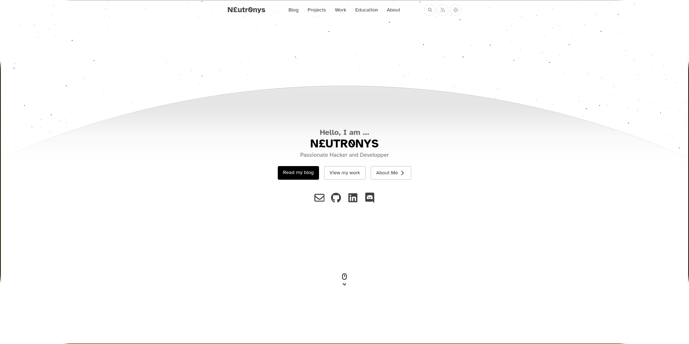
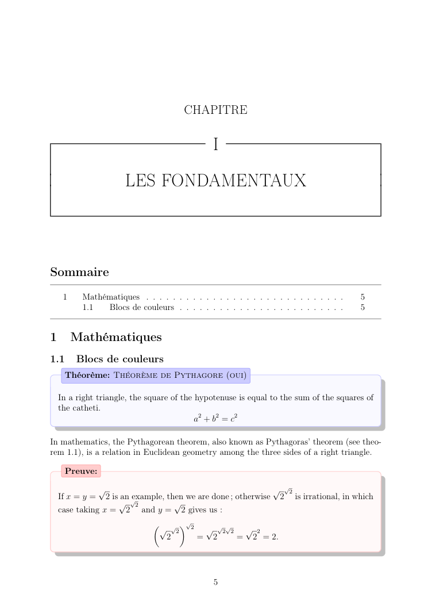
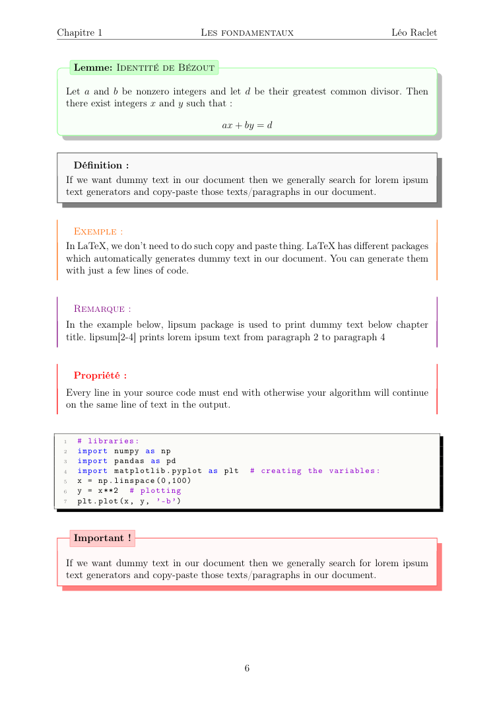

<!--    -->

# 🤔 &nbsp; About Me !

Hi 👋 ! My name is **Leo**, and I'm a french engineering student in second year at [**Télécom
Saint-Etienne**](https://www.telecom-st-etienne.fr/), in France 🇫🇷 . I'm particularly interested
in **computer science** and **cybersecurity** 🖥️.

Meanwhile, I also develop things on my free time, mostly in **C / C++** and **Python**, but I always
use and learn new tools.  

You can learn more on me by vising my [**portfolio website**](https://leoraclet.github.io)

## 💬 &nbsp; Contact

Feel free to contact me on my email address. You can also check my **LinkedIn** and **Root-Me**
profiles 👤 !

&nbsp;

&nbsp;

&nbsp;

&nbsp;
 

## 🛠️ &nbsp; Technologies & Tools

While developping my projects, I have learned and used many languages, technologies and tools, on
various platforms.

### Languages

### Frameworks

### Tools

### Platforms

### Softwares

## 📂 &nbsp; Projects

## [🐧 &nbsp; NixOS Config *(2025)*](https://github.com/leoraclet/nixos-config)

My NixOS 🐧 Linux ❄️ flake configuration, using Hyprland  

	

 

## [💬 &nbsp; Ptibot *(2025)*](https://github.com/leoraclet/ptibot)

 My little friendly Discord bot, in Python  

	

 

## [🌐 &nbsp; Django SaaS Template *(2025)*](https://github.com/leoraclet/django-saas-template)

A fully featured template for building a Django-based SaaS application with Docker.

	

 

## [✒️ &nbsp; Blog & Portfolio *(2025)*](https://github.com/leoraclet/leoraclet.github.io)

My personnal Portfolio & Blog ✒️

	

 

## [📚  &nbsp; Hack&Learn *(2025)*](https://github.com/leoraclet/wiki)

My personnal Wiki - Hack&Learn 📚

	

 

## [📜   &nbsp; Handsome LaTeX *(2023)*](https://github.com/leoraclet/handsome-latex)

Handsome LaTeX is a LaTeX template for your outstanding documents

<a align="center" href="https://github.com/leoraclet/handsome-latex">

|                                              |                                              |
| :------------------------------------------: | :------------------------------------------: |
|  |  |

</a>

 

## [❄️ &nbsp; Fractal generator *(2022)*](https://github.com/leoraclet/fractals)

This program is a fractal generator, made in **C / C++** using **SFML**, that let you generate and
explore colored fractals such as Mandelbrot and Julia sets. Deep zooms in real time are made by
possible by emulating double floating precision on GPU.  

	

 

## [🛡️ &nbsp; Game of life *(2021)*](https://github.com/leoraclet/game-of-life)

This program is a simulation of the famous Game of Life invented by the Cambridge mathematician John
Conway in 1970. It is made in **C / C++** using the **SDL**.  

	

 

## [🪙 &nbsp; Unycoin *(2023)*](https://github.com/leoraclet/unycoin)

This project is a pure **Python** implementation of a cryptocurrency similar to Bitcoin as it was
first introduced by Satoshi Nakamoto's whitepaper : [Bitcoin: A Peer-to-Peer Electronic Cash
System](https://bitcoin.org/bitcoin.pdf).  

	

 

## [🃏 &nbsp; SuperMemo *(2024)*](https://github.com/leoraclet/super-memo)

This is a school project in which we were tasked to build a simple flashcard application like Anki,
with a UI for the user to interact with.  

	

## Stats

&nbsp;
